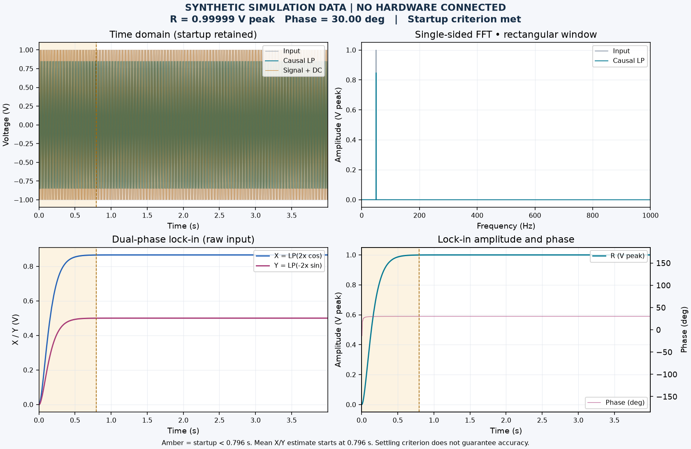
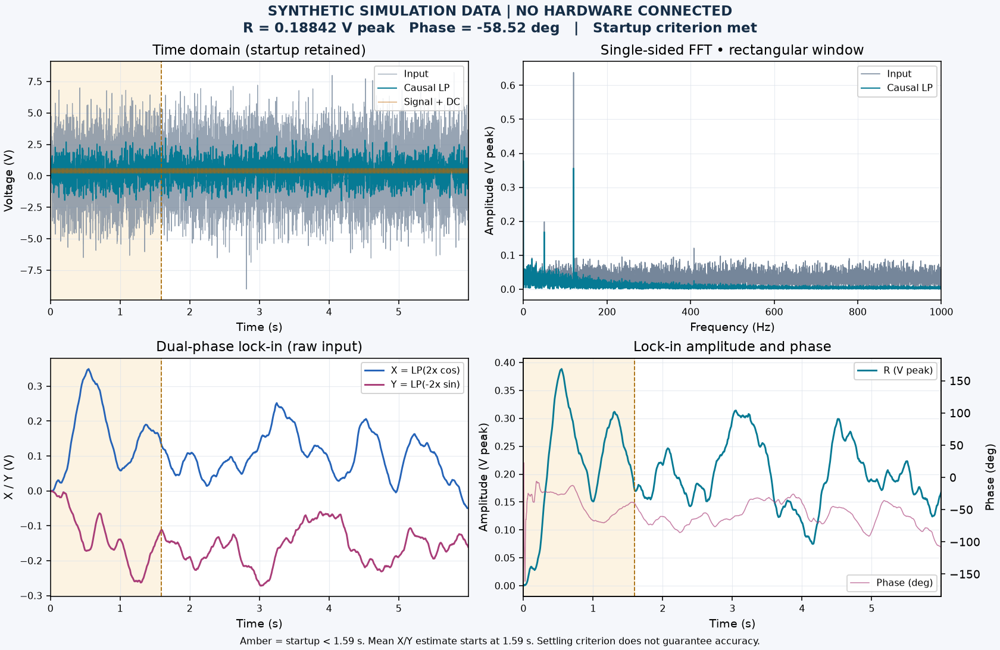
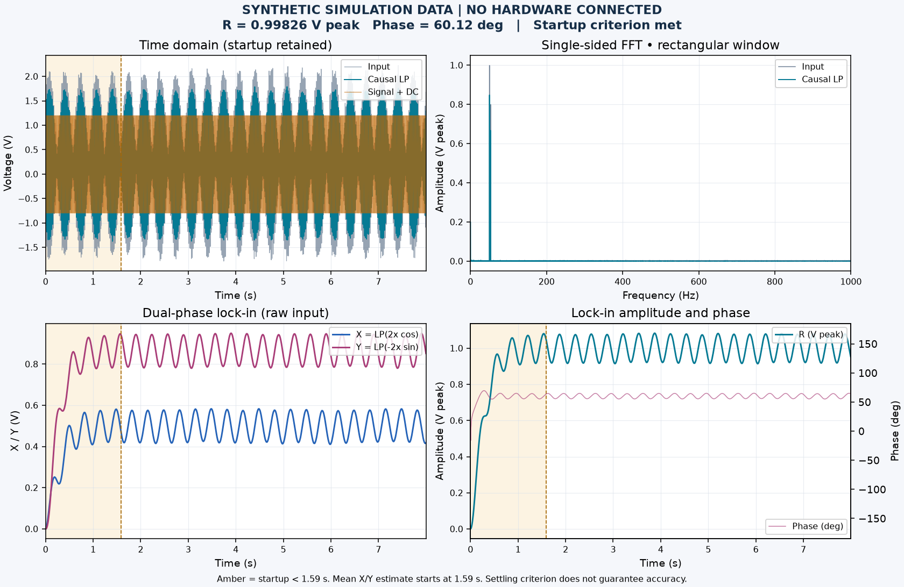

# 15 分钟上手：看懂信号、噪声与锁相

**本教程全部使用合成仿真数据，没有硬件连接，也不是任何人的真实实验记录。** 每节约五分钟：先写下预测，再运行，最后对照答案。目标是会解释曲线和状态提示，不是把读数调整到“看起来正确”。完整数学约定与边界见 [实验参考](experiments.md)。

先按 [README](../README.md) 安装源码环境，在仓库根目录选用本机命令启动界面。也可打开已核对来源与自测结果的便携包。

Windows PowerShell：

```powershell
$labPython = '.\.venv\Scripts\python.exe'
& $labPython -m virtual_instrument_lab
```

macOS Terminal：

```bash
labPython=.venv/bin/python
"$labPython" -m virtual_instrument_lab
```

以下无界面命令使用 macOS 的 `.venv/bin/python`；Windows 请将这个前缀替换为 `& $labPython`，后面的参数保持不变。每条命令在独立输出目录生成 CSV、设置 JSON 与 PNG。教程图片与答案来自保存的 [结果记录](tutorial-data/results.json)，同一设置和软件环境便于复现；跨依赖版本不要求图像文件逐字节相同。

每节保留三行笔记：你的预测、实际看到的现象、解释发生变化的那个参数。读数之外也记录稳定状态和警告。这样可以区分“参数设定”“有限记录的估计”和“你对现象的解释”，避免事后只抄答案。

三组基准均使用采样率 2000 Hz、50 Hz 主信号/参考、80 Hz 单级输入低通、seed 42。锁相用两级因果低通，截止频率依次为 2、1、1 Hz；时长依次为 4、6、8 s。每组链接的 JSON 记录全部参数，包括相位、直流与干扰，载入后即可复现。

## 1. Clean reference：幅值与相位应该是多少？

**先预测。** 主信号是 `1 × cos(2π × 50t + 30°)`，噪声、干扰与直流都为零，参考为 50 Hz。结果中的幅值应该接近 1、2 还是 `1/√2` V？X 与 Y 的符号分别是什么？80 Hz 输入低通会完全保留 50 Hz 幅度吗？滤波器刚开始时的读数能否直接当成稳态结果？先用纸记下答案。

**再运行。** 选 `Clean reference`，点击 `Run simulation`，或用 [已保存设置](tutorial-data/clean_reference/settings.json) 的 `Load settings…` 载入并运行。先看输入时域，再看 X/Y 与幅值曲线，找到启动区间的阴影和状态提示；结果卡片对应平均后的 X/Y。需要可分享的导出文件时运行：

```bash
.venv/bin/python -m virtual_instrument_lab --headless --preset "Clean reference" --output-dir output/tutorial/clean_reference
```



**答案。** 幅值应接近 **1 V 峰值**；2 V 是峰峰值，`1/√2` V 是纯正弦 RMS。按本项目符号约定，`X≈cos(30°)`、`Y≈sin(30°)`，两者均为正，相位接近 30°。因果滤波从零状态开始，开头的弯曲和爬升是启动瞬态，应保留而不是裁掉。表内是这一份合成记录的估计，不是无限精度的理论值。

<!-- tutorial-result:clean_reference:start -->
合成记录 `clean_reference`（seed = 42）：

| 量 | 当前程序结果 |
|---|---:|
| 样本数 / 最后采样时刻 | 8000 / 3.9995 s |
| 平均 X / 平均 Y | 0.866013 / 0.499993 V |
| 平均矢量幅值 R（峰值） | 0.999986 V |
| 平均矢量相位 | 29.999991° |
| 启动阈值 / 估计区间起点 | 0.795775 / 0.7960 s |
| 估计区间样本数 / 状态 | 6408 / 启动条件已满足 |
| 50 Hz 谱线：输入 / 低通后 | 1.000000 / 0.848326 V peak |
<!-- tutorial-result:clean_reference:end -->

看图时也比较输入和低通后的曲线：后者可以衰减、滞后，但本项目的锁相混频取自原始输入。不要把“输入低通后的幅度”与“锁相输出幅度”当成同一个量。频谱纵轴采用峰值幅度；本例是整周期信号，适合先建立读图习惯，任意改频率后最高谱线不一定等于设定幅值。

再把主信号幅值设为 0，保持其他信号源为零：相位应显示未定义。零矢量没有可确定的方向，不能把它写成“测得 0°”。

## 2. Buried in noise：短时间内有读数就算稳定吗？

**先预测。** 主信号峰值只有 0.2 V，相位 −45°，高斯噪声标准差为 2 V，还叠加 120 Hz 干扰。原始曲线能轻松看出主信号吗？相同 seed 再运行一次会得到新噪声吗？把记录从 6 s 缩到 1 s，是否只会减少图上的点，而不影响结果可信程度？

**再运行。** 先运行 `Buried in noise` 或载入 [6 s 设置](tutorial-data/buried_in_noise/settings.json)，观察频谱与 X/Y，再重复一次。随后通过 `Load settings…` 载入 [1 s 对照设置](tutorial-data/noise_short/settings.json)，点击运行并对比稳定状态。这份对照只改变记录时长；不要同时改 seed 或滤波带宽。

```bash
.venv/bin/python -m virtual_instrument_lab --headless --preset "Buried in noise" --output-dir output/tutorial/buried_in_noise
```



**答案。** 固定 seed、参数和软件环境会重现同一组噪声；它提供可比较的案例，不保证每次结果都贴近 0.2 V。锁相利用参考频率和有限低通带宽抑制部分噪声，输入波形依然可以很杂乱。6 s 与 1 s 的差别还包括滤波启动过程：短记录必须标为未充分稳定，给出的数字只是末段临时估计。本 seed 的短记录碰巧更接近设定值，但这不能证明短记录估计通常更可靠。

<!-- tutorial-result:buried_in_noise:start -->
合成记录 `buried_in_noise`（seed = 42）：

| 量 | 当前程序结果 |
|---|---:|
| 样本数 / 最后采样时刻 | 12000 / 5.9995 s |
| 平均 X / 平均 Y | 0.098396 / -0.160683 V |
| 平均矢量幅值 R（峰值） | 0.188417 V |
| 平均矢量相位 | -58.518412° |
| 启动阈值 / 估计区间起点 | 1.591549 / 1.5920 s |
| 估计区间样本数 / 状态 | 8816 / 启动条件已满足 |
<!-- tutorial-result:buried_in_noise:end -->

<!-- tutorial-result:noise_short:start -->
合成记录 `noise_short`（seed = 42）：

| 量 | 当前程序结果 |
|---|---:|
| 样本数 / 最后采样时刻 | 2000 / 0.9995 s |
| 平均 X / 平均 Y | 0.123060 / -0.154475 V |
| 平均矢量幅值 R（峰值） | 0.197500 V |
| 平均矢量相位 | -51.458088° |
| 启动阈值 / 估计区间起点 | 1.591549 / 0.8000 s |
| 估计区间样本数 / 状态 | 400 / **未充分稳定：临时估计** |

程序警告：

- Not fully settled: estimates use the final 20% and are provisional.
<!-- tutorial-result:noise_short:end -->

若还有时间，恢复长记录，再只降低锁相截止频率。预期波动减少，但启动所需时间增加；如果记录不够长，先延长时长再解释结果。噪声标准差也不是这段有限记录恰好具有的 RMS，不能把两个数字完全相等作为检查是否正确的条件。

最后仅改变 seed 再观察一次。误差会随噪声样本变化；判断噪声条件下的性能需要多次记录，不能挑一张最好看的图。

## 3. Nearby interference：启动结束就一定锁对了吗？

**先预测。** 主信号为 50 Hz、1 V 峰值、60°，干扰为 53 Hz，参考为 50 Hz。混频后的邻频干扰落在几 Hz？如果只把参考改为 49 Hz，X/Y 还能停在固定方向吗？即使状态显示启动已充分稳定，是否可以忽略参考频率不匹配的警告？

**再运行。** 运行 `Nearby interference` 或载入 [匹配参考设置](tutorial-data/nearby_interference/settings.json)，观察 X/Y 的低频波动。再载入 [49 Hz 参考对照](tutorial-data/nearby_mismatch/settings.json) 并运行，记录波动、幅值卡片和警告的变化。这里只改变参考频率，不改变输入主信号或干扰。

```bash
.venv/bin/python -m virtual_instrument_lab --headless --preset "Nearby interference" --output-dir output/tutorial/nearby_interference
```



**答案。** 匹配参考时，53 Hz 干扰产生 3 Hz 差频分量，有限低通不能把它完全消除。参考改成 49 Hz 后，50 Hz 主信号自身也产生 1 Hz 差频，X/Y 随时间转动。结果卡片计算的是 `hypot(mean(X), mean(Y))`；转动矢量在平均时会相消，因此小读数不等于输入主信号消失了。

<!-- tutorial-result:nearby_interference:start -->
合成记录 `nearby_interference`（seed = 42）：

| 量 | 当前程序结果 |
|---|---:|
| 样本数 / 最后采样时刻 | 16000 / 7.9995 s |
| 平均 X / 平均 Y | 0.497291 / 0.865578 V |
| 平均矢量幅值 R（峰值） | 0.998260 V |
| 平均矢量相位 | 60.121791° |
| 启动阈值 / 估计区间起点 | 1.591549 / 1.5920 s |
| 估计区间样本数 / 状态 | 12816 / 启动条件已满足 |
| 平均瞬时幅值 mean(R(t)) | 0.999886 V |
<!-- tutorial-result:nearby_interference:end -->

<!-- tutorial-result:nearby_mismatch:start -->
合成记录 `nearby_mismatch`（seed = 42）：

| 量 | 当前程序结果 |
|---|---:|
| 样本数 / 最后采样时刻 | 16000 / 7.9995 s |
| 平均 X / 平均 Y | -0.004775 / -0.020934 V |
| 平均矢量幅值 R（峰值） | 0.021471 V |
| 平均矢量相位 | -102.848145° |
| 启动阈值 / 估计区间起点 | 1.591549 / 1.5920 s |
| 估计区间样本数 / 状态 | 12816 / 启动条件已满足 |
| 平均瞬时幅值 mean(R(t)) | 0.499654 V |

程序警告：

- Reference frequency differs from the signal: quadratures rotate and averaging can reduce amplitude.
<!-- tutorial-result:nearby_mismatch:end -->

把图中逐时刻幅值的起伏，与表内“平均瞬时幅值”和“平均矢量幅值”对照。前者先取长度再平均，后者先平均方向分量再取长度，旋转时二者可以相差很大。失配记录里即使显示一个数值相位，也只是这段有限区间的平均矢量方向，不能解释为已经锁定的固定输入相位。

启动标记只回答“滤波初始状态是否衰减了足够久”，不回答“参考是否匹配”或“估计是否准确”。完成后，试着用一句话分别解释峰值、临时估计和失配警告；若能将解释对应到图与设置，再进入 [完整实验练习](experiments.md)。

## 复核与更新这份材料

在源码环境中运行（Windows 仍使用上面的解释器替换方式）：

```bash
.venv/bin/python scripts/tutorial_materials.py --check
```

它在临时目录执行上面的三条导出命令，并用现有仿真/导出接口复算两个对照；回读 CSV 和全部设置，比较答案、PNG 标记、图中文字及已保存图像的 SHA-256。CSV 不提交到仓库，可随时重新导出。图像保留整个启动过程；50 Hz 低通谱线来自整段记录，包含瞬态，不等同于无限稳态的滤波器增益。

[结果记录](tutorial-data/results.json) 保存完整精度数值、参数、PCG64 噪声发生器、生成环境版本及程序源码哈希。数值允许浮点舍入差异：电压绝对误差 1e-9 V、相对误差 1e-8；相位 1e-6°；时间 1e-10 s。不承诺跨未来依赖版本的噪声逐字节一致；Windows/macOS CI 会检查当前依赖能否复现答案，图像不要求跨系统字节相同。

维护者需要更新材料时可运行 `.venv/bin/python scripts/tutorial_materials.py --write`，再运行 `--check` 并人工审查三张 PNG 和文字。`--write` 会更新本页结果区块、设置、图片与结果记录；`--check` 不改已提交的材料。三个基准图由程序直接导出，不是桌面截图，也不代表人工完成了真实测量。
